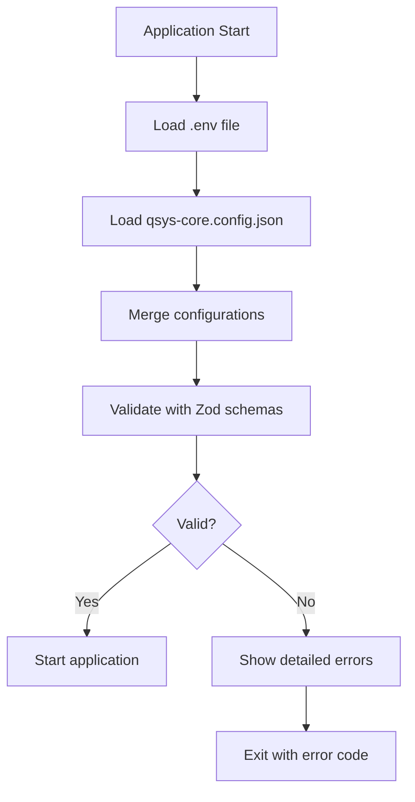

# 📁 Configuration Architecture

## 🎯 **Separation of Concerns**

This project uses **multiple configuration files** with clear separation of responsibilities. This eliminates duplication, improves maintainability, and provides better user experience.

---

## 📋 **Configuration Files Overview**

| File | Purpose | Format | Contains | User Edits |
|------|---------|--------|----------|------------|
| **`qsys-core.config.json`** | Q-SYS Core connection | JSON | Host, port, credentials, connection settings | ✅ Primary |
| **`.env`** | Environment & secrets | Key=Value | OpenAI API key, environment variables | ✅ API keys only |
| **`.env.example`** | Environment template | Key=Value | Template and documentation | ❌ Reference only |
| **`package.json`** | Project metadata | JSON | Dependencies, scripts, project info | ❌ Auto-managed |
| **`tsconfig.json`** | TypeScript config | JSON | Compiler options, paths | ❌ Development only |

---

## 🎛️ **Q-SYS Configuration: `qsys-core.config.json`**

### **Why JSON for Q-SYS?**
- ✅ **User-friendly**: JSON is easier to read and edit
- ✅ **Structured**: Supports nested settings and arrays
- ✅ **Self-documenting**: Includes examples and comments
- ✅ **Validation**: Better error messages for invalid config
- ✅ **Version control friendly**: Clean diffs, no secrets

### **Example Configuration:**
```json
{
  "qsysCore": {
    "host": "192.168.50.150",
    "port": 443,
    "username": "",
    "password": "",
    "connectionSettings": {
      "timeout": 10000,
      "reconnectInterval": 5000,
      "maxReconnectAttempts": 5,
      "heartbeatInterval": 30000,
      "pollingInterval": 350,
      "enableAutoReconnect": true
    }
  },
  
  "examples": {
    "localEmulator": {
      "host": "127.0.0.1",
      "port": 1710
    },
    "productionCore": {
      "host": "10.0.1.50", 
      "port": 443
    }
  }
}
```

### **Priority Order:**
1. **JSON config** (primary) - `qsys-core.config.json`
2. **Environment variables** (fallback) - `.env` QSYS_* settings
3. **Default values** (last resort) - hardcoded in code

---

## 🤖 **Environment Configuration: `.env`**

### **Why .env for Environment?**
- ✅ **Security**: API keys and secrets stay local
- ✅ **Environment-specific**: Different values for dev/prod
- ✅ **Standard practice**: Widely adopted pattern
- ✅ **Git ignored**: Never committed to version control
- ✅ **Process variables**: Easily accessible in code

### **Example Configuration:**
```bash
# Node.js Environment
NODE_ENV=development
LOG_LEVEL=info

# OpenAI API Configuration
OPENAI_API_KEY=sk-your-actual-api-key-here
OPENAI_MODEL=gpt-4
OPENAI_VOICE=nova

# Security Secrets
JWT_SECRET=your-jwt-secret-here
SESSION_SECRET=your-session-secret-here
```

### **What DOESN'T Go in .env:**
- ❌ Q-SYS Core IP addresses (use JSON config)
- ❌ Q-SYS connection settings (use JSON config)
- ❌ Complex nested settings (use JSON config)
- ❌ Version-controlled settings (use JSON config)

---

## 🔄 **Configuration Loading Process**



### **Loading Priority:**
1. **JSON config** overrides environment variables
2. **Environment variables** override default values
3. **Default values** used as last resort

### **Code Implementation:**
```typescript
// Load Q-SYS config from JSON if available
const qsysConfig = loadQSysConfigFromJSON();

// Environment schema with JSON config precedence
const envSchema = z.object({
  QSYS_HOST: z.string().ip().default(qsysConfig?.host ?? 'fallback'),
  QSYS_PORT: z.number().default(qsysConfig?.port ?? 443),
  // ... other settings
});
```

---

## 🛠️ **Setup Process**

### **Automated Setup:**
```bash
# Run the setup script
./setup-env.sh

# This will:
# 1. Create .env from .env.example
# 2. Check qsys-core.config.json exists
# 3. Show configuration separation
# 4. Provide next steps
```

### **Manual Setup:**
```bash
# 1. Environment file
cp .env.example .env
# Edit .env: Add OpenAI API key

# 2. Q-SYS configuration  
# Edit qsys-core.config.json: Update host IP

# 3. Test configuration
npm run dev
```

---

## 🧪 **Testing Configuration**

### **Connection Tests:**
```bash
# Test Q-SYS connection (uses JSON config)
npm run test:connection

# Test component control (uses JSON config)  
node tests/integration/qsys/test-component-control.mjs

# Test main application (uses both configs)
npm run dev
```

### **Configuration Validation:**
- **JSON Schema**: Validates qsys-core.config.json structure
- **Zod Validation**: Validates environment variables and types
- **Runtime Checks**: Connection and API key validation
- **Error Messages**: Clear guidance for configuration issues

---

## 🔍 **Troubleshooting**

### **Common Configuration Issues:**

#### **Q-SYS Connection Failed**
- ✅ Check `qsys-core.config.json` has correct host IP
- ✅ Verify Q-SYS Core has WebSocket capability enabled
- ✅ Ensure port 443 is accessible

#### **OpenAI API Errors**  
- ✅ Check `.env` file has valid OPENAI_API_KEY
- ✅ Verify API key starts with 'sk-'
- ✅ Check OpenAI account has sufficient credits

#### **Environment Validation Errors**
- ✅ Check `.env` file syntax (no spaces around =)
- ✅ Verify required fields are present
- ✅ Check file permissions

### **Configuration Debugging:**
```bash
# Check current configuration
node -e "console.log(process.env)" | grep -E "(QSYS|OPENAI)"

# Validate JSON config
node -e "console.log(JSON.parse(require('fs').readFileSync('qsys-core.config.json')))"

# Test environment loading
npm run type-check
```

---

## 📈 **Benefits of This Architecture**

### **For Users:**
- ✅ **Easier setup**: Clear separation of what goes where
- ✅ **Better documentation**: JSON config includes examples
- ✅ **No duplication**: Each setting has one source of truth
- ✅ **Clear errors**: Better validation and error messages

### **For Developers:**
- ✅ **Maintainable**: Single source of truth for each config type
- ✅ **Type-safe**: Full TypeScript validation
- ✅ **Flexible**: Easy to add new configuration options
- ✅ **Testable**: Clear configuration boundaries

### **For Operations:**
- ✅ **Secure**: API keys never in version control
- ✅ **Environment-specific**: Different configs for dev/prod
- ✅ **Auditable**: Clear configuration hierarchy
- ✅ **Troubleshootable**: Detailed error messages

---

This configuration architecture ensures **clarity**, **security**, and **maintainability** while providing an excellent user experience for setup and configuration. 🎯 